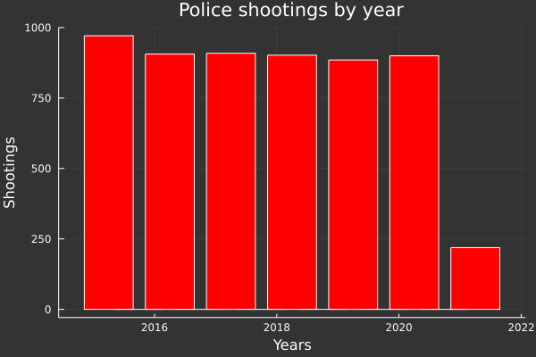

```julia
using DataFrames,UrlDownload;

url = "https://raw.githubusercontent.com/NicJC/Datasets/main/Police.csv"

police = urldownload(url) |> DataFrame
```


<table class="data-frame"><thead><tr><th></th><th>Column1</th><th>Date</th><th>Year</th><th>Name</th><th>Manner of Death</th><th>Race</th></tr><tr><th></th><th>Int64</th><th>Date…</th><th>Int64</th><th>String?</th><th>String</th><th>String</th></tr></thead><tbody><p>5,692 rows × 9 columns (omitted printing of 3 columns)</p><tr><th>1</th><td>0</td><td>2015-01-02</td><td>2015</td><td>Tim Elliot</td><td>shot</td><td>Asian</td></tr><tr><th>2</th><td>1</td><td>2016-10-11</td><td>2016</td><td>Michael L. Taylor</td><td>shot</td><td>Asian</td></tr><tr><th>3</th><td>2</td><td>2017-06-14</td><td>2017</td><td>Tommy Le</td><td>shot and Tasered</td><td>Asian</td></tr><tr><th>4</th><td>3</td><td>2017-07-08</td><td>2017</td><td>Michael Anthony Rude</td><td>shot</td><td>Asian</td></tr><tr><th>5</th><td>4</td><td>2018-12-31</td><td>2018</td><td>Iosia Faletogo</td><td>shot</td><td>Asian</td></tr><tr><th>6</th><td>5</td><td>2019-02-19</td><td>2019</td><td>Clayton Joseph</td><td>shot</td><td>Asian</td></tr><tr><th>7</th><td>6</td><td>2019-05-31</td><td>2019</td><td>Jesse Sarey</td><td>shot</td><td>Asian</td></tr><tr><th>8</th><td>7</td><td>2020-01-10</td><td>2020</td><td>Clando Anitok</td><td>shot and Tasered</td><td>Asian</td></tr><tr><th>9</th><td>8</td><td>2020-01-21</td><td>2020</td><td>Sok Chin Son</td><td>shot and Tasered</td><td>Asian</td></tr><tr><th>10</th><td>9</td><td>2015-01-28</td><td>2015</td><td>Matautu Nuu</td><td>shot and Tasered</td><td>Asian</td></tr><tr><th>11</th><td>10</td><td>2015-03-04</td><td>2015</td><td>Carl Lao</td><td>shot</td><td>Asian</td></tr><tr><th>12</th><td>11</td><td>2015-04-08</td><td>2015</td><td>Joseph Jeremy Weber</td><td>shot</td><td>Asian</td></tr><tr><th>13</th><td>12</td><td>2015-05-05</td><td>2015</td><td>Thong Kien Ma</td><td>shot</td><td>Asian</td></tr><tr><th>14</th><td>13</td><td>2015-07-02</td><td>2015</td><td>Ton Nguyen</td><td>shot</td><td>Asian</td></tr><tr><th>15</th><td>14</td><td>2015-09-09</td><td>2015</td><td>William Chau</td><td>shot</td><td>Asian</td></tr><tr><th>16</th><td>15</td><td>2015-12-14</td><td>2015</td><td>Mharloun Verdejo  Saycon</td><td>shot</td><td>Asian</td></tr><tr><th>17</th><td>16</td><td>2015-12-29</td><td>2015</td><td>Siolosega Velega-Nuufolau</td><td>shot</td><td>Asian</td></tr><tr><th>18</th><td>17</td><td>2015-12-29</td><td>2015</td><td>Tien Hua</td><td>shot</td><td>Asian</td></tr><tr><th>19</th><td>18</td><td>2016-04-30</td><td>2016</td><td>Marion Habana</td><td>shot</td><td>Asian</td></tr><tr><th>20</th><td>19</td><td>2016-05-11</td><td>2016</td><td>Thongsoune Vilaysane</td><td>shot</td><td>Asian</td></tr><tr><th>21</th><td>20</td><td>2016-06-28</td><td>2016</td><td>Barry Prak</td><td>shot</td><td>Asian</td></tr><tr><th>22</th><td>21</td><td>2016-11-19</td><td>2016</td><td>Luke Smith</td><td>shot and Tasered</td><td>Asian</td></tr><tr><th>23</th><td>22</td><td>2016-12-24</td><td>2016</td><td>Zhonghua Li</td><td>shot</td><td>Asian</td></tr><tr><th>24</th><td>23</td><td>2017-01-15</td><td>2017</td><td>Sinuon Pream</td><td>shot and Tasered</td><td>Asian</td></tr><tr><th>25</th><td>24</td><td>2017-04-22</td><td>2017</td><td>Joseph Sin</td><td>shot</td><td>Asian</td></tr><tr><th>26</th><td>25</td><td>2017-12-08</td><td>2017</td><td>Vernchoy Saechao</td><td>shot</td><td>Asian</td></tr><tr><th>27</th><td>26</td><td>2018-01-05</td><td>2018</td><td>Andy Vo</td><td>shot</td><td>Asian</td></tr><tr><th>28</th><td>27</td><td>2018-01-09</td><td>2018</td><td>Thompson Nguyen</td><td>shot</td><td>Asian</td></tr><tr><th>29</th><td>28</td><td>2018-03-21</td><td>2018</td><td>Jehad Eid</td><td>shot</td><td>Asian</td></tr><tr><th>30</th><td>29</td><td>2018-04-05</td><td>2018</td><td>Nathaniel Prasad</td><td>shot</td><td>Asian</td></tr><tr><th>&vellip;</th><td>&vellip;</td><td>&vellip;</td><td>&vellip;</td><td>&vellip;</td><td>&vellip;</td><td>&vellip;</td></tr></tbody></table>


```julia
first(police,5)
```


<table class="data-frame"><thead><tr><th></th><th>Column1</th><th>Date</th><th>Year</th><th>Name</th><th>Manner of Death</th><th>Race</th><th>Gender</th></tr><tr><th></th><th>Int64</th><th>Date…</th><th>Int64</th><th>String?</th><th>String</th><th>String</th><th>String?</th></tr></thead><tbody><p>5 rows × 9 columns (omitted printing of 2 columns)</p><tr><th>1</th><td>0</td><td>2015-01-02</td><td>2015</td><td>Tim Elliot</td><td>shot</td><td>Asian</td><td>M</td></tr><tr><th>2</th><td>1</td><td>2016-10-11</td><td>2016</td><td>Michael L. Taylor</td><td>shot</td><td>Asian</td><td>M</td></tr><tr><th>3</th><td>2</td><td>2017-06-14</td><td>2017</td><td>Tommy Le</td><td>shot and Tasered</td><td>Asian</td><td>M</td></tr><tr><th>4</th><td>3</td><td>2017-07-08</td><td>2017</td><td>Michael Anthony Rude</td><td>shot</td><td>Asian</td><td>M</td></tr><tr><th>5</th><td>4</td><td>2018-12-31</td><td>2018</td><td>Iosia Faletogo</td><td>shot</td><td>Asian</td><td>M</td></tr></tbody></table>


```julia
d = (police[:2:6])
```


<table class="data-frame"><thead><tr><th></th><th>Date</th><th>Year</th><th>Name</th><th>Manner of Death</th><th>Race</th></tr><tr><th></th><th>Date…</th><th>Int64</th><th>String?</th><th>String</th><th>String</th></tr></thead><tbody><p>5,692 rows × 5 columns</p><tr><th>1</th><td>2015-01-02</td><td>2015</td><td>Tim Elliot</td><td>shot</td><td>Asian</td></tr><tr><th>2</th><td>2016-10-11</td><td>2016</td><td>Michael L. Taylor</td><td>shot</td><td>Asian</td></tr><tr><th>3</th><td>2017-06-14</td><td>2017</td><td>Tommy Le</td><td>shot and Tasered</td><td>Asian</td></tr><tr><th>4</th><td>2017-07-08</td><td>2017</td><td>Michael Anthony Rude</td><td>shot</td><td>Asian</td></tr><tr><th>5</th><td>2018-12-31</td><td>2018</td><td>Iosia Faletogo</td><td>shot</td><td>Asian</td></tr><tr><th>6</th><td>2019-02-19</td><td>2019</td><td>Clayton Joseph</td><td>shot</td><td>Asian</td></tr><tr><th>7</th><td>2019-05-31</td><td>2019</td><td>Jesse Sarey</td><td>shot</td><td>Asian</td></tr><tr><th>8</th><td>2020-01-10</td><td>2020</td><td>Clando Anitok</td><td>shot and Tasered</td><td>Asian</td></tr><tr><th>9</th><td>2020-01-21</td><td>2020</td><td>Sok Chin Son</td><td>shot and Tasered</td><td>Asian</td></tr><tr><th>10</th><td>2015-01-28</td><td>2015</td><td>Matautu Nuu</td><td>shot and Tasered</td><td>Asian</td></tr><tr><th>11</th><td>2015-03-04</td><td>2015</td><td>Carl Lao</td><td>shot</td><td>Asian</td></tr><tr><th>12</th><td>2015-04-08</td><td>2015</td><td>Joseph Jeremy Weber</td><td>shot</td><td>Asian</td></tr><tr><th>13</th><td>2015-05-05</td><td>2015</td><td>Thong Kien Ma</td><td>shot</td><td>Asian</td></tr><tr><th>14</th><td>2015-07-02</td><td>2015</td><td>Ton Nguyen</td><td>shot</td><td>Asian</td></tr><tr><th>15</th><td>2015-09-09</td><td>2015</td><td>William Chau</td><td>shot</td><td>Asian</td></tr><tr><th>16</th><td>2015-12-14</td><td>2015</td><td>Mharloun Verdejo  Saycon</td><td>shot</td><td>Asian</td></tr><tr><th>17</th><td>2015-12-29</td><td>2015</td><td>Siolosega Velega-Nuufolau</td><td>shot</td><td>Asian</td></tr><tr><th>18</th><td>2015-12-29</td><td>2015</td><td>Tien Hua</td><td>shot</td><td>Asian</td></tr><tr><th>19</th><td>2016-04-30</td><td>2016</td><td>Marion Habana</td><td>shot</td><td>Asian</td></tr><tr><th>20</th><td>2016-05-11</td><td>2016</td><td>Thongsoune Vilaysane</td><td>shot</td><td>Asian</td></tr><tr><th>21</th><td>2016-06-28</td><td>2016</td><td>Barry Prak</td><td>shot</td><td>Asian</td></tr><tr><th>22</th><td>2016-11-19</td><td>2016</td><td>Luke Smith</td><td>shot and Tasered</td><td>Asian</td></tr><tr><th>23</th><td>2016-12-24</td><td>2016</td><td>Zhonghua Li</td><td>shot</td><td>Asian</td></tr><tr><th>24</th><td>2017-01-15</td><td>2017</td><td>Sinuon Pream</td><td>shot and Tasered</td><td>Asian</td></tr><tr><th>25</th><td>2017-04-22</td><td>2017</td><td>Joseph Sin</td><td>shot</td><td>Asian</td></tr><tr><th>26</th><td>2017-12-08</td><td>2017</td><td>Vernchoy Saechao</td><td>shot</td><td>Asian</td></tr><tr><th>27</th><td>2018-01-05</td><td>2018</td><td>Andy Vo</td><td>shot</td><td>Asian</td></tr><tr><th>28</th><td>2018-01-09</td><td>2018</td><td>Thompson Nguyen</td><td>shot</td><td>Asian</td></tr><tr><th>29</th><td>2018-03-21</td><td>2018</td><td>Jehad Eid</td><td>shot</td><td>Asian</td></tr><tr><th>30</th><td>2018-04-05</td><td>2018</td><td>Nathaniel Prasad</td><td>shot</td><td>Asian</td></tr><tr><th>&vellip;</th><td>&vellip;</td><td>&vellip;</td><td>&vellip;</td><td>&vellip;</td><td>&vellip;</td></tr></tbody></table>


```julia
x=(d[:4])
y=(d[:2])
```


    5692-element Array{Int64,1}:
     2015
     2016
     2017
     2017
     2018
     2019
     2019
     2020
     2020
     2015
     2015
     2015
     2015
        ⋮
     2018
     2019
     2019
     2015
     2021
     2017
     2019
     2020
     2020
     2021
     2016
     2018


```julia
using Statistics,Plots

plot(y, 
    t = [:histogram :scatter :steppre :bar :line], 
    background_color = RGB(0.2, 0.2, 0.2),
    leg = false, 
    bar_width = 0.8,
    fill = (0, :red)
     )

title!("Police shootings by year")
yaxis!("Shootings")
xaxis!("Years")
```


    

    


```julia

```
